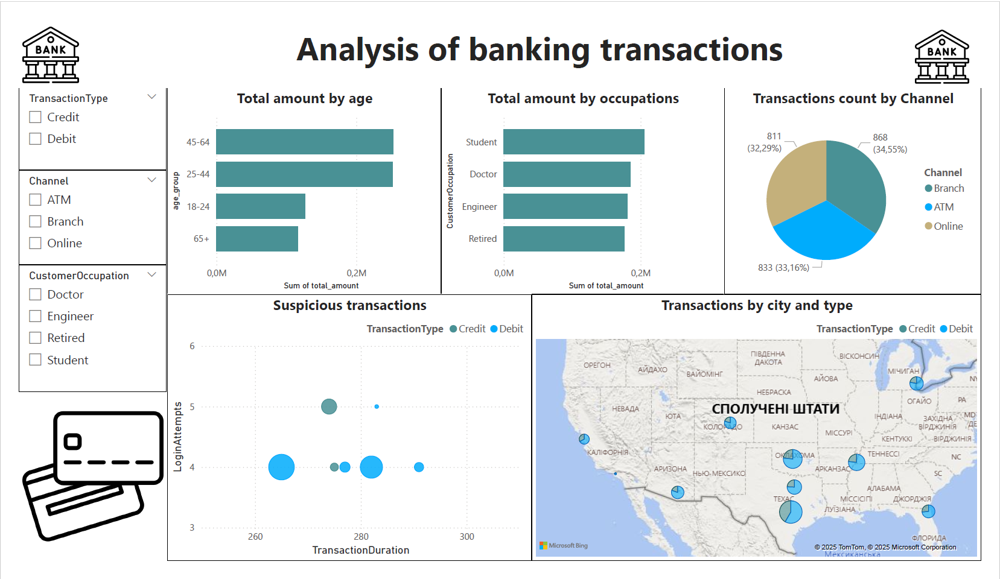

# Аналіз банківських транзакцій

Аналіз транзакцій за допомогою PostgreSQL і Power BI для виявлення трендів і аномалій.

## Опис
Проект включає:
- Аналіз даних (датасету) у PostgreSQL (перевірка на некоректні, пропущені значення, формат значень)
- Агрегацію за містами, віком, професіями, каналами.
- Візуалізацію в Power BI.

## Структура
- `data/`bank_transactions_data.xlsx : датасет з Kaggle https://www.kaggle.com/datasets/valakhorasani/bank-transaction-dataset-for-fraud-detection
- `data/processed/`: Агреговані CSV.
- `sql/`: SQL-запити.
- `powerbi/`: Power BI файл.
- `docs/`: Скріншоти та PDF-звіт.

## Інсайти
- Найактивніші міста: Los Angeles, San Diego.
- Студенти використовують онлайн-канали.
- Виявлено підозрілі транзакції з високим `TransactionDuration`.

